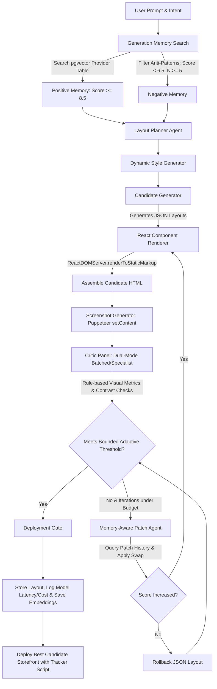

# Implementation Plan - Nudge V2: Advanced Agentic Architecture Migration

Refactor the Nudge AI Website Builder from a single-generation pipeline into a self-improving, iterative, memory-aware "AI Design Agency" inspired by Sakana AI Scientist and ShinkaEvolve.

---

## 1. System Flow & Architecture

The diagram below details the complete Nudge V2 lifecycle, incorporating the layout planner, batched/specialist critic panels, React SSR renderer, component-level analytics, evolutionary benchmark gates, and rollback systems.



---

## 2. Updated Database Schema (`packages/db/schema.sql`)

Add these final table definitions to `packages/db/schema.sql`.

```sql
-- 0. Enable pgvector extension
create extension if not exists vector;

-- 1. Unified Generation Memory: Stores layouts and prompt metadata
create table if not exists generation_memory (
  id uuid primary key default gen_random_uuid(),
  prompt text not null,
  business_description text not null,
  style_keywords text[] not null,
  industry text not null,
  style text not null,
  design_tokens jsonb not null,
  layout jsonb not null,
  score numeric not null,
  screenshot_url text,
  created_at timestamptz default now()
);

-- 2. Isolated Embedding Tables per dimension to avoid schema explosion
create table if not exists generation_embeddings_1536 (
  id uuid primary key default gen_random_uuid(),
  generation_id uuid references generation_memory(id) on delete cascade,
  provider text not null, -- 'openai', 'cohere'
  model_name text not null, -- 'text-embedding-3-small'
  embedding vector(1536) not null,
  created_at timestamptz default now()
);

create index if not exists generation_embeddings_1536_hnsw_idx 
  on generation_embeddings_1536 using hnsw (embedding vector_cosine_ops);

-- 3. Component Archive Index: Manages metadata & file-pointers
create table if not exists component_archive (
  id uuid primary key default gen_random_uuid(),
  name text not null, -- e.g., 'hero', 'footer', 'about'
  version text not null, -- e.g., 'HeroV1', 'HeroV2', 'HeroV10'
  file_path text not null, -- Relative codebase path pointing to React template
  semantic_metadata jsonb not null, -- e.g. { "design_intent": "high bold text", "visual_characteristics": ["asymmetrical"] }
  created_at timestamptz default now(),
  unique(name, version)
);

-- 4. Component Score with context metadata
create table if not exists component_score (
  id uuid primary key default gen_random_uuid(),
  component_name text not null, -- e.g., "HeroV2"
  industry text not null,
  style text not null,
  page_type text not null default 'storefront',
  usage_count integer not null default 0,
  avg_score numeric not null default 0.0,
  created_at timestamptz default now(),
  updated_at timestamptz default now(),
  unique(component_name, industry, style, page_type)
);

-- 5. Patch Learning Table with confidence and reasoning
create table if not exists patch_learning (
  id uuid primary key default gen_random_uuid(),
  industry text not null,
  style text not null,
  weakness text not null,
  patch_action jsonb not null, -- e.g. { "component": "hero", "action": "replace", "with": "HeroV3" }
  reasoning text not null, -- Explains why this specific patch worked
  success_count integer not null default 0,
  failure_count integer not null default 0,
  confidence_score numeric not null default 0.0,
  created_at timestamptz default now()
);

-- 6. Component-Level Analytics: Captures real-world user interaction on specific elements
create table if not exists component_analytics (
  id uuid primary key default gen_random_uuid(),
  store_id uuid not null references stores(id) on delete cascade,
  component_name text not null, -- e.g., "HeroV3"
  clicks integer default 0,
  impressions integer default 0,
  conversions integer default 0,
  updated_at timestamptz default now()
);

-- 7. User Feedback Loop
create table if not exists user_feedback (
  id uuid primary key default gen_random_uuid(),
  store_id uuid not null references stores(id) on delete cascade,
  rating integer check (rating between 1 and 5),
  thumbs_up_down boolean,
  feedback_text text,
  created_at timestamptz default now()
);

-- 8. Model Performance Tracking (including latency & token cost metrics)
create table if not exists model_performance (
  id uuid primary key default gen_random_uuid(),
  model_name text not null,
  task text not null, -- 'research', 'design', 'content', 'builder', 'evaluator', 'patch'
  avg_score numeric not null default 0.0,
  success_rate numeric not null default 0.0,
  avg_latency_ms numeric not null default 0.0,
  avg_tokens integer not null default 0,
  total_calls integer not null default 0,
  created_at timestamptz default now(),
  updated_at timestamptz default now(),
  unique(model_name, task)
);
```

---

## 3. Core Architectural Upgrades

### A. React Templates & ReactDOMServer Compiler
Component files will live in the codebase as **React Functional Components**:
`/apps/builder/lib/pipeline/components/templates/`
- Component styling uses vanilla CSS in matching files.
- The `Component Renderer` imports the React component tree defined by the Layout Plan JSON and compiles it to static HTML/CSS on the server using `ReactDOMServer.renderToStaticMarkup()`.
This keeps the storefront bundle lightweight while unlocking full interactivity (state/hooks) and proper modular component design.

### B. Dual-Mode Evaluation (Batched & Specialist Critics)
- **Batched Mode**: Evaluates in a single LLM request by prompting one model to output a structured JSON containing all five critic reports.
- **Specialist Mode**: (For high-tier requests or after testing) Spins up 5 parallel requests to independent instances, using unique agent instructions for design, UX, accessibility, SEO, and conversion critics.

### C. Visual Metrics & Rule-Based Contrast Engine
Programmatic analysis of the HTML prior to LLM calls:
- Checks text-to-background contrast (enforces WCAG 4.5:1 ratio).
- Validates structural heading hierarchies (e.g. no H3 before H2).
- Asserts mobile responsiveness tags and touch target minimum sizes (44px).

### D. Bounded Adaptive Threshold Gate
The threshold score is dynamic based on top generations, bounded by a safe clamp:
- Floor: `8.0` (ensure minimal criteria always met).
- Ceiling: `9.2` (avoid infinite iterations).
- Calculation: `clamp(8.0, 80th_percentile_score, 9.2)`

### E. Component-Level Analytics Tracker
Generated storefronts inject a tracking script mapping interaction events to components:
- Interactive HTML elements compile with attributes like `data-nudge-comp="HeroV3"`.
- Click and conversion actions trigger API updates to `component_analytics`.

### F. Statistical Anti-Pattern Threshold
Failures (`score < 6.5`) are added to negative prompt constraints **only if the failure count (N) for that specific component/style combo is >= 5**, filtering out noisy outliers.

### G. Evolution Quality Gate
When breeding new components (combining HTML/CSS characteristics of two successful components):
- Deploy draft component in a test harness.
- Run Critic Panel evaluation.
- The mutated component is saved **only if the test score is higher than the parent average**:
  `score_evolved > (score_parent_A + score_parent_B) / 2`

---

## 4. File Layout

```
packages/
  db/
    schema.sql (modified)
    src/types.ts (modified)
apps/
  builder/
    lib/
      pipeline/
        index.ts (modified)
        orchestrator.ts (modified)
        types.ts (modified)
        components/
          templates/
            hero/
              HeroV1.tsx
              HeroV1.css
              HeroV2.tsx
            footer/
              FooterV1.tsx
          registry.ts (NEW)
          evolve-components.ts (NEW)
        agents/
          layout-planner.ts (NEW)
          style-generator.ts (NEW)
          evaluator-ensemble.ts (NEW)
          patch-agent.ts (NEW)
        utils/
          memory.ts (NEW)
          renderer.tsx (NEW: React server compiler)
          metrics.ts (NEW)
```

---

## 5. Verification Plan

### Automated Tests
- Test React compilation to static HTML markup.
- Test dual-mode evaluator switching and structured responses.
- Verify clamp limits on adaptive threshold logic.
- Verify evolution benchmark gate accepts only scoring improvements.

### Manual Verification
- Test component-level tracking scripts with mocked user clicks.
- Check database logs after running evolutionary crossovers.
